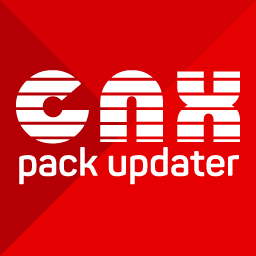

<h1 align="center">APG - Atualizador Pacote GameMod</h1>

Um homebrew de Nintendo Switch, baseado no homebrew [AIO-Switch-Updater](https://github.com/HamletDuFromage/aio-switch-updater/), para fazer o download e atualizar firmwares e o custom firmware [GMPACK](https://github.com/coldmvm/gmpack/releases).

GMPACK é um pacote de custom firmware que inclui o Atmosphère, sigpatches, hekate, nyx e vários outros homebrews.

Este homebrew suporta Atmosphère, ReiNX e SXOS, e funciona em consoles não corrigidos (`Erista`) and corrigidos (`V2/Mariko`).

## **[FAÇA O DOWNLOAD POR AQUI!](https://github.com/coldmvm/gmpack-updater/releases)**

## Como instalar
Copie o diretório `gmpack-updater/` para a pasta `/switch/` no seu microSD.

## Descrição das funções
### ⬦ Baixar GMPACK
- Baixa o custom firmware GMPACK. Após baixado, o programa irá instalar o pacote para você.

### ⬦ Baixar traduções
- As traduções são feitas por membros da cena e tem a finalidade de distribuir acessibilidade linguística aos jogos.
- Algumas traduções precisam de passos específicos para que funcionem. Para maiores detalhes consulte os sites dos criadores das legendas:
  - https://www.jumpmanclubbrasil.com.br/
  - https://traducoespkg.tumblr.com/
  - https://nintendonxbr.blogspot.com/

### ⬦ Baixar firmwares
- Baixa os arquivos do firmware para a pasta `/firmware` que, posteriormente, podem ser instalados usando o homebrew DayBreak.

## Extras (na página `Ferramentas`)
- Atualizar o homwbrew automaticamente quando existir uma nova versão.
- Editar as configurações da internet (DNS, endereço IP, MTU, etc). Adicione suas próprias configurações em `config/aio-switch-updater/internet.json`. Você vai achar um modelo desta configuração neste repositório.
- Abrir o navegador de internet do Switch (precisa abrir usando um jogo e pressionar R).
- Limpar os arquivos temporários baixados.
- Consultar as alterações sofridas pelo homebrew (changelog).

## Disclaimer
A GameMod design não detém nenhum direito de cópia sobre nenhum arquivo baixado por este homebrew e todo o crédito pertence aos seus respectivos proprietários. Se o atual proprietário do arquivo baixado por este atualizador solicitar, removeremos imediatamente a habilidade de baixar qualquer arquivo problemático.

## Agradecimentos especiais
- [HamletDuFromage](https://github.com/HamletDuFromage/) pelo brilhante homebew AIO-Switch-Updater.
- [natinusala](https://github.com/natinusala) pela biblioteca Borealis.
- [Team Neptune](https://github.com/Team-Neptune) pelo código RCM usado.
- [CostelaBR](https://github.com/AMSNX) pela sugestão da função de baixar traduções.

## 📝 Licença

O nome Nintendo Switch e logo são marcas registradas de [Nintendo](https://github.com/Nintendo). Este repositório ñão é afiliado a [Nintendo](https://github.com/Nintendo) ou nenhum dos seus parceiros.

The Nintendo Switch names and logos are a trademark of [Nintendo](https://github.com/Nintendo). This repository is in no way affiliated with [Nintendo](https://github.com/Nintendo) or any of its partners.
